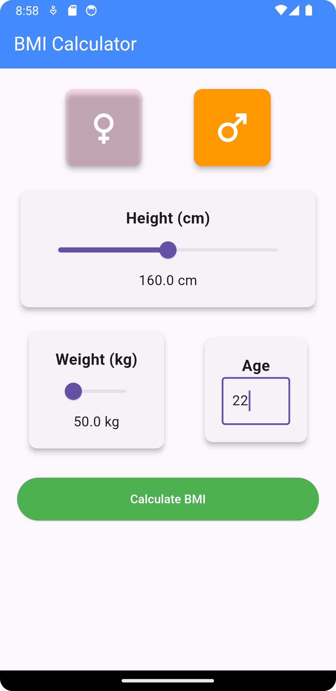
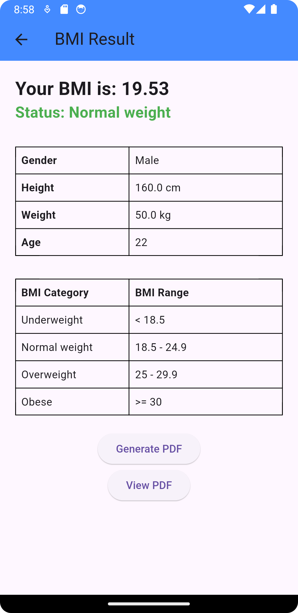
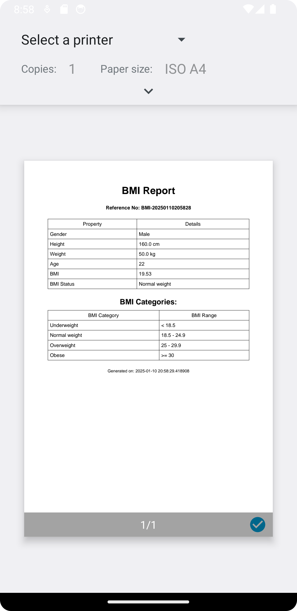

# BMI Calculator App

A simple BMI (Body Mass Index) Calculator app built with Flutter and Dart. The app allows users to calculate their BMI by entering their weight and height. It provides the result along with an interpretation of the BMI value (Underweight, Normal, Overweight, or Obese).

## Features
- Input fields for weight (in kg) and height (in centimeters).
- Calculate BMI using the formula: `BMI = weight / (height * height)`.
- Display the calculated BMI with corresponding interpretation.
- Clear input fields for re-entry.
- Responsive UI designed for both mobile phones and tablets.

## Screenshots

## Usage

- Open the app and you will see two input fields: one for weight (in kg) and one for height (in centimeters).
- Enter your weight and height.
- Tap the "Calculate" button to get your BMI.
- The result will be displayed along with an interpretation of your BMI category:
    - **Underweight**: BMI < 18.5
    - **Normal**: 18.5 <= BMI <= 24.9
    - **Overweight**: 25 <= BMI <= 29.9
    - **Obese**: BMI >= 30
- You can also tap the "Clear" button to reset the input fields.

## Technologies Used

- **Flutter**: A UI toolkit for building natively compiled applications for mobile, web, and desktop from a single codebase.
- **Dart**: The programming language used to develop the Flutter app.

